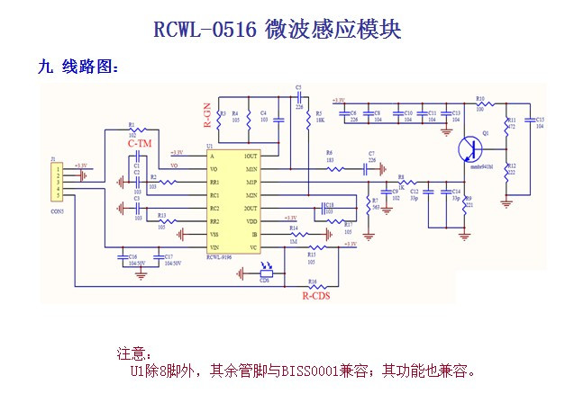

# RCWL-0516 information

Last update: 3 Jan 2017. Please send and feedback, corrections to jdesbonnet@gmail.com or post to the issue tracker.

RCWL-0516 is a doppler radar microwave motion sensor module which can act as an alternative to a PIR motion sensor. This git repository is an attempt to collect the rather scant information on this board in one place.

At the heart of the module is a RCWL-9196 IC. Unfortunately I can't find any datasheets or detailed information about this. The pin out is very similar to the BISS0001 PIR IC (details below). 

The unit I have was supplied by IC station (SKU 10630): http://www.icstation.com/rcwl-0516-microwave-motion-sensor-module-radar-sensor-body-induction-module-100ma-p-10630.html

Operating frequency: The product information omits the operating frequncy. I had assumed the 5.8GHz ISM band, but I was unable to see any signal with my HackRF One SDR. A more likely possibility is the X-Band [3] at around 10GHz which is common for motion detector doppler radars. Unfortunately I have no equipment capable of detecting this (my HackRF One upper frequency is 6GHz). I found a similars boards with similar PCB layouts operating at 10.525GHz [4].

Working voltage: 4 - 28V. It provides a convenient 3.3V output to drive a MCU (good for 100mA ?).

The forward side of the board is the side with components. This side should face the objects being detected. Do not obstruct forward side with anything metalic. The back side should have clearance of more than 1cm from any metal. 

## Board header

| Pin   | Function |
| ---   | --- |
| 3V3   | 3.3V regulated output. Max 100mA (?)                  |
| GND   | Ground                                                |
| OUT   | Trigger: high (3.3V) if motion detected. 0V normally. |
| VIN   | 4 - 28V supply voltage                                |
| CDS   |    (light sensor related.. TODO)                        |

## Schematic

The only schematic I could find is very low resolution and it's hard to make out some of the text.

Q1 : looks like a mmbr951M high frequency NPN transistor. It is not clear from the schematic how this works. My understanding of a doppler radar is that a continuous wave is transmitted and a the transmitted signal is mixed with the signal from the receiver. But this board seems very simple with just one transistor (Q1) and just a hand full of passive componetents. 

My thinking is that Q1 along with the PCB design and passive components form a 10GHz oscillator / antenna. The reflected signal combines additively with the transmitted signal forming a beat frequncy which is the difference of the two frequencies. This beat frequency is extracted by a low pass filter (C9 = 1nF ? / R3 = 1k ?) and amplified by the RCWL-9196 IC. I'm not a RF expert so this is purely speculative. 

## RCWL-9196

This is the core IC of the board. The schematic says (in chinese) that it's similar to a BISS0001 PIR IC. But there are differences. Unfortunately I can't find any hard information (eg datasheet) on this. Nor can I find any information on the brand/company name "RCWL". 

| Pin number | BISS0001 | RCWL-9196 |
| --- | --- | --- |
| 1 | A Retriggerable & non-retriggerable mode select (A=1 : re-triggerable) | 3.3V regulated output (100mA max?) |
| 2 | VO Detector output pin (active high) | same |
| 3 | RR1 Output pulse width control (Tx)  | ? |
| 4 | RC1 Output pulse width control (Tx)  | ? |
| 5 | RC2 Trigger inhibit control (Ti)     | ? |
| 6 | RR2 Trigger inhibit control (Ti)     | ? |
| 7 | Vss Ground                           | same |
| 8 | VRF RESET & voltage reference input (Normally high. Low=reset) |  Vin (4 - 28V) |
| 9 | VC Trigger disable input (VC > 0.2Vdd=enable; Vc < 0.2Vdd =disabled) | ? |
| 10 | IB Op-amp input bias current setting                                | ? |
| 11 | Vdd Supply voltage                                                  | 3.3V regulated output (again?) |
| 12 | 2OUT 2nd stage Op-amp output                                        | ? |
| 13 | 2IN- 2nd stage Op-amp inverting input                               | ? |
| 14 | 1IN+ 1st stage Op-amp non-inverting input                           | ? |
| 15 | 1IN- 1st stage Op-amp inverting input                               | ? |
| 16 | 1OUT 1st stage Op-amp output                                        | ? |

## Adjustment components

On the back of the board (the side without components) are pads for 3 optional components (0805 dimensions). 

| Pad | Function |
| --- | --- |
| C-TM |  Reguate the repeat trigger time. The default (unpopulated) time is 2s. A SMD capacitor to extend the repeat trigger time. Pin 3 of the IC emits a frequency (f), and the tigger time in seconds is given by (1/f) * 32678 |
| R-GN | The default detection range is 7m, adding a 1M resistor reduces it to 5m |
| R-CDS| the VCC is in parrel connection with CDS(RCWL-9196 pin 9) through R-CDS. Connect the LDR at the R-CDS to turn off the detecting function at night. (?? TODO: make sense of this) |

## Doppler effect calculations

f' = f (c + v) / c

where f = transmit frequency, f' is refelected frequency, v = speed of observer (negative if receeding, positive if advancing toward sensor), c = speed of light

Assume typical human motion speed of 1 m/s. f = 10.525GHz, c = 2.998E8 m/s. f' = 10.525000035GHz. Beat frequency f'-f = 35Hz.

Adding two sine waves of equal amplitude:
y(t) = Acos(2πf1t) + Acos(2πf2t) = 2Acos(2πt(f1+f2)/2)cos(2πt(f1-f2)/2)

Adding two sine waves of unequal amplitude: 
y(t) = Acos(2πf1t) + Bcos(2πf2t) = (A+B)cos(2πt(f1+f2)/2)cos(2πt(f1-f2)/2) + (A-B)sin(2πt(f1+f2)/2)sin(2πt(f1-f2)/2)

## References

[1] http://wiki.seeedstudio.com/images/2/2f/Twig_-_BISS0001.pdf

[2] http://highfreqelec.summittechmedia.com/Apr07/HFE0407_Polivka.pdf

[3] https://en.wikipedia.org/wiki/X_band

[4] https://www.bestfinds.org/microwave-sensor-module-10-525ghz-s01-type-single-pcb-microwave-radar-motion-sensor-module-for-ceiling-light-sensor-32a9cf9fba6ba68d.html
http://szhaiwang.en.made-in-china.com/product/lvMQxCLJYshG/China-Microwave-Sensor-Module-10-525GHz-Doppler-Radar-Motion-Detector-Arduino-HW-M09-.html

