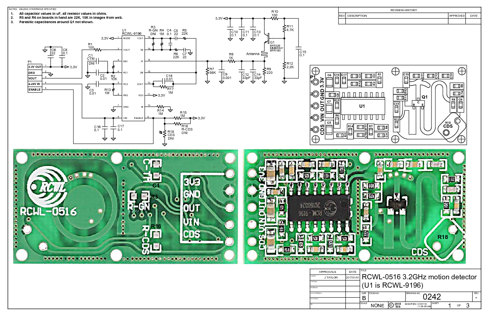
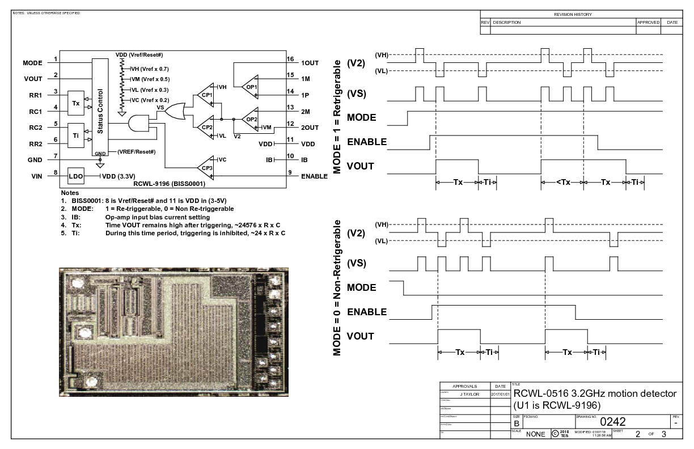
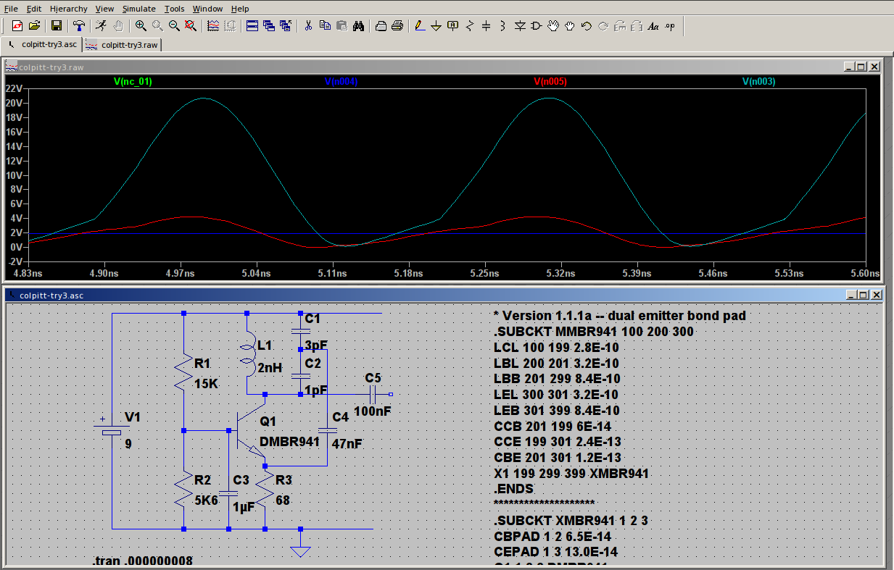

# RCWL-0516 information

**There is a lively discussion on the [project issue tracker](https://github.com/jdesbonnet/RCWL-0516/issues). So make sure you check it out. If anyone wants to help keeping this main page updated let me know.**

RCWL-0516 is a doppler radar microwave motion sensor module which can act as an alternative to a PIR motion sensor. This git repository is an attempt to collect the rather scant information on this board in one place.

The unit I have was supplied by IC station (SKU 10630): http://www.icstation.com/rcwl-0516-microwave-motion-sensor-module-radar-sensor-body-induction-module-100ma-p-10630.html  (Use coupon code 'joeics' for a 15% discount).

Operating frequency: The product specification omits the operating frequncy. I found a carrier at 3.181GHz on my unit using a HackRF One SDR radio (see spectrum plot below). I suspect this frequency will vary from device to device: it would be difficult to have a tight specification with such a simple RF circuit on FR4 PCB.

Working voltage: 4 - 28V. It provides a convenient 3.3V output to drive a MCU (good for 100mA ?).

The forward side of the board is the side with components. This side should face the objects being detected. Do not obstruct forward side with anything metalic. The back side should have clearance of more than 1cm from any metal. 

## Board header

| Pin   | Function |
| ---   | --- |
| 3V3   | 3.3V regulated output. Max 100mA (?)                  |
| GND   | Ground                                                |
| OUT   | Trigger: high (3.3V) if motion detected. 0V normally. |
| VIN   | 4 - 28V supply voltage                                |
| CDS   | LDR 10-20k RL, U_LDR > 0.7V = On                      |

## Schematic

Schematics contributed by [John Taylor](https://www.tayloredge.com/). Original PDF file
[here](https://www.tayloredge.com/reference/Electronics/RF/0242.pdf).

There are two parts to this circuit: 1. A microwave frequency transmitter/receiver/mixer and 2.a much lower frequency part based on an IC (marked RCWL-9196) which is very similar to the BISS0001 IC used in PIR motion detectors.

First the microwave part:

The best explanation of how the microwave part of this works is in patent [EP3091605A1](https://patents.google.com/patent/EP3091605A1/en). It describes as similar type of module operating at 5.8GHz.

At the heart of the RF is a Q1 a MMBR941M high frequency NPN transistor [5] in what is probably a [Colpitt oscillator](https://en.wikipedia.org/wiki/Colpitts_oscillator) [6] configuration. The schematic above is misleading because it omits a key inductor and capacitors constructed from PCB traces (a microline inductor and capacitor). The inductor is the S curve trace on the top surface and capacitors are the ring structure on the bottom surface and also the rectangular block to the left of the S curve. Using the formula at reference [12] below I calculte the inductance of the S curve to be (very approximately) 10nH.

A critical function of a doppler radar is to be able to 'mix' the reflected signal with the transmitted signal to arrive at a frequency which is the difference between the transmitted and reflected signal. In this board Q1 also cleverly assumes the function of the mixer: [TODO: this really needs to be explained].
 
The low doppler frequency difference is extracted by a low pass RC filter (C9 = 1nF, R3 = 1k, fc = 1/2πRC ≈ 160kHz) and amplified by the RCWL-9196 IC and treated exactly the same as a signal from a PIR sensor. 

Update 4 Jan 2017: finally found the signal at 3.181GHz with the HackRF One SDR! One interesting observation: waving my hand in front of the sensor causes significant changes in the transmitting frequency, shifting by up to 1MHz. My theory: the low frequency doppler shift causes small changes in the transistor base bias. I used spice simulations to verify that small changes to transistor base bias causes changes in oscillation frequency. By running a few simulations I estimate that 1µV change in bias will change oscillation frequncy by 1.4MHz.

The low frequncy part

The core of the low frequncy signal processing is an IC marked RCWL-9196. The schematic says (in chinese) that it's similar to a BISS0001 PIR IC. But there are differences. Unfortunately I can't find any hard information (eg datasheet) on this. Nor can I find any information on the brand/company name "RCWL". 

| Pin number | BISS0001 | RCWL-9196 |
| --- | --- | --- |
| 1 | A Retriggerable & non-retriggerable mode select (A=1 : re-triggerable) | 3.3V regulated output (100mA max?) |
| 2 | VO Detector output pin (active high) | same |
| 3 | RR1 Output pulse width control (Tx)  | same? |
| 4 | RC1 Output pulse width control (Tx)  | same? |
| 5 | RC2 Trigger inhibit control (Ti)     | same? |
| 6 | RR2 Trigger inhibit control (Ti)     | same? |
| 7 | Vss Ground                           | same |
| 8 | VRF RESET & voltage reference input (Normally high. Low=reset) |  Vin (4 - 28V) |
| 9 | VC Trigger disable input (VC > 0.2Vdd=enable; Vc < 0.2Vdd =disabled) | same |
| 10 | IB Op-amp input bias current setting                                | ? |
| 11 | Vdd Supply voltage                                                  | 3.3V regulated output (again?) |
| 12 | 2OUT 2nd stage Op-amp output                                        | same |
| 13 | 2IN- 2nd stage Op-amp inverting input                               | same |
| 14 | 1IN+ 1st stage Op-amp non-inverting input                           | same |
| 15 | 1IN- 1st stage Op-amp inverting input                               | same |
| 16 | 1OUT 1st stage Op-amp output                                        | same |

## Adjustment components

On the back of the board (the side without components) are pads for 3 optional components (0805 dimensions). 

| Pad | Function |
| --- | --- |
| C-TM |  Regulate the repeat trigger time. The default (unpopulated) time is 2s. A SMD capacitor to extend the repeat trigger time. Pin 3 of the IC emits a frequency (f), and the tigger time in seconds is given by (1/f) * 32678 |
| R-GN | The default detection range is 7m, adding a 1M resistor reduces it to 5m |
| R-CDS| the VCC is in parrel connection with CDS(RCWL-9196 pin 9) through R-CDS. Connect the LDR at the R-CDS to turn off the detecting function at night. (?? TODO: make sense of this) |

## Spice simulation

I started with an example Colpitt circuit [9] and substituted the 2N3904 NPN with a MMBR941 (Spice model from [10]). I am using the Windows LTSpice from Linear Technologies (available as free download [11], also works with Linux under Wine emulator).
See [colpitt.asc](./spice/colpitt.asc) for a working Colpitt oscillator and [rcwl-0516.asc](./spice/rcwl-0516.asc) for a model of the RCWL-0516 (however it does not oscillate!).

## Regulatory compliance
[TODO] 

## Doppler effect calculations

If ft is the transmitted frequency, fr is the reflected frequency (as measured by the common transmit/receive antenna on the sensor), v is the speed of the target relative to the sensor  (negative if receeding, positive if advancing toward sensor), c is the speed of light and fd = (fr-fd) is the doppler shift, then:

fr = ft (c + v) / (c - v)

fd = fr - ft = 2v ft / (c - v)  

If ( c << v) then fd ≈ 2v ft / c 

Assume typical human motion speed of v = 1 m/s. ft = 3.181GHz, c = 2.998E8 m/s, then fd = 10Hz.

## References

[1] http://wiki.seeedstudio.com/images/2/2f/Twig_-_BISS0001.pdf

[2] http://highfreqelec.summittechmedia.com/Apr07/HFE0407_Polivka.pdf

[3] https://en.wikipedia.org/wiki/X_band

[4] Links to similar modules:

https://www.bestfinds.org/microwave-sensor-module-10-525ghz-s01-type-single-pcb-microwave-radar-motion-sensor-module-for-ceiling-light-sensor-32a9cf9fba6ba68d.html

http://szhaiwang.en.made-in-china.com/product/lvMQxCLJYshG/China-Microwave-Sensor-Module-10-525GHz-Doppler-Radar-Motion-Detector-Arduino-HW-M09-.html

http://www.ebay.com/itm/LV002-10-525GHz-8-15m-Doppler-Radar-Microwave-Sensor-Switch-Module-/262461703972?hash=item3d1befc724:g:39kAAOSwepZXTTSu

Inside another doppler radar microwave LED lamp (bigclivedotcom):
https://www.youtube.com/watch?v=2xHhLbhbb0k

Microwave doppler sensor lamp with perplexingly simple circuitry (bigclivedotcom):
https://www.youtube.com/watch?v=FgdXRLjYkc4

[5] http://cache.freescale.com/files/product/doc/MMBR941.pdf

[6] https://en.wikipedia.org/wiki/Colpitts_oscillator

[6] https://en.wikipedia.org/wiki/Doppler_radar

[7] https://www.youtube.com/watch?v=jAeFQEHWLZU

[8] http://electronics.stackexchange.com/questions/53554/can-we-build-capacitors-on-a-pcb-board
https://www.jlab.org/accel/eecad/pdf/050rfdesign.pdf
http://www.qsl.net/va3iul/Microstrip_Stripline_CPW_Design/Microstrip_Stripline_and_CPW_Design.pdf

[9] Colpitts Oscillator Practical Project
http://www.learnabout-electronics.org/Oscillators/osc24.php

[10] MMBR941 Spice Model
http://ltwiki.org/files/LTspiceIV/Vendor%20List/Motorola/Spice/RFBJT/MMBR941.lib

[11] LTSpice
http://www.linear.com/designtools/software/#LTspice

[12]
http://coil32.net/meandr-pcb-coil.html

## Patents

US5227667A: Microwave proximity switch 
https://patents.google.com/patent/US5227667A

CN203352555U: Doppler microwave radar inductive switch 
https://www.google.com/patents/CN203352555U?cl=en

CN203434265U (also US20150236403A1, WO2014169502A1, EP3091605A1) : Planar antenna microwave module and intelligent control energy-saving lamp 
https://patents.google.com/patent/CN203434265U/en
https://patents.google.com/patent/US20150236403A1/en
https://patents.google.com/patent/WO2014169502A1/en
https://patents.google.com/patent/EP3091605A1/en

CN101738640A: Induction module of microwave motion sensor
https://patents.google.com/patent/CN101738640A/en

## Credits

 * [John Taylor](https://www.tayloredge.com/) for the clean schematics.

 * [IC Station](https://www.icstation.com/) who provided a module for evaluation. The module evaluated here can be [ordered from their site](http://www.icstation.com/rcwl-0516-microwave-motion-sensor-module-radar-sensor-body-induction-module-100ma-p-10630.html). Use coupon code 'joeics' for a 15% discount. There are many [similar modules in their catalog](http://www.icstation.com/advanced_search_result.php?keywords=microwave&search_in_description=1).  Disclosure: this module was provided to me free of charge in exchange for a review / blog post etc. (value US $1.34). 

 * [Thomas Peng Pan](http://www.mobile-chinese.com/blog/) for help with translation of the Chinese text on the schematic.

## Other videos, articles, links etc

From: Roger Clarke ( https://github.com/rogerclarkmelbourne ) 

http://www.rogerclark.net/investigating-a-rcwl-9196-rcwl-0516-radar-motion-detector-modules/

Please check the GitHub issue tracker for the most recent contributions/observations: https://github.com/jdesbonnet/RCWL-0516/issues

Might higher quality schematic from John Taylor (https://electronics.stackexchange.com/users/173758/john-taylor) here:
https://www.tayloredge.com/reference/Electronics/RF/0242.pdf

This video from [The Signal Path](https://www.youtube.com/user/TheSignalPathBlog/featured) explains the operation of a similar module (CDM324) in great detail:  https://www.youtube.com/watch?v=5vqSX40seqA

This video from DroneBot Workshop is a good tutorial specifically for the RCWL-0516 module:
https://www.youtube.com/watch?v=IJoPkKlxFXA  (thanks for that tip [underwoodblog](https://github.com/underwoodblog) !)

A video from Big Clive "How microwave body detectors work. With RF section schematic."
https://www.youtube.com/watch?v=Hf19hc9PtcE (again thanks to [underwoodblog](https://github.com/underwoodblog) )

## Updates

14 May 2019: More main page content updates.

21 Aug 2018: Added link to The Signal Path video explaing operation of similar module:
 https://www.youtube.com/watch?v=5vqSX40seqA
 
13 Feb 2018: Added link to high quality schematics by John Taylor ( https://www.tayloredge.com/reference/Electronics/RF/0242.pdf )

18 June 2017: New section 'Other Links and Articles' 

4 Jan 2017: Thanks to tear down review on YouTube [7] I've revaluated the operating frequency.

5 Jan 2017: Added annotated schematic.

12 Jan 2017: Added links to related microwave proximity switch activated LED bulbes. Added section for related patents and credits.

13 Jan 2017: Added links to more relevant patents.

21 Jan 2017: Added section on Spice simulation of the circuit.
