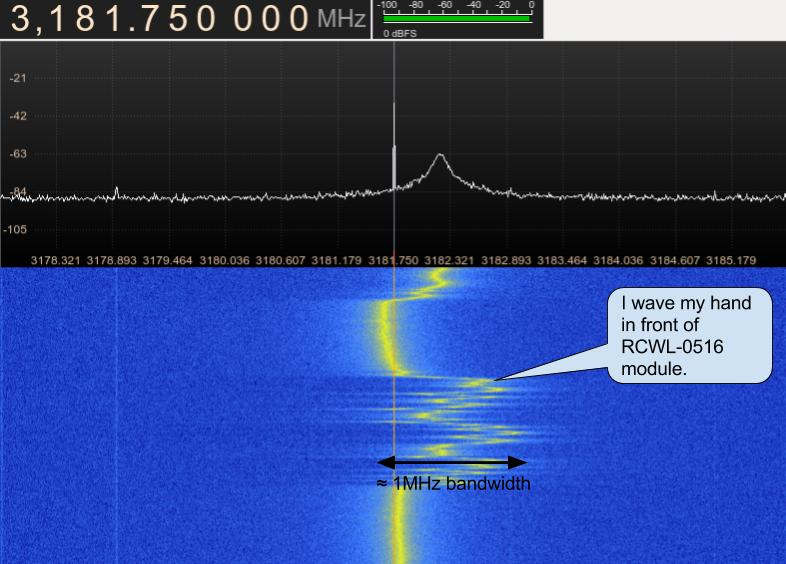

# RCWL-0516 information

Last update: 13 Jan 2017. Please send and feedback, corrections to jdesbonnet@gmail.com or post to the issue tracker.

RCWL-0516 is a doppler radar microwave motion sensor module which can act as an alternative to a PIR motion sensor. This git repository is an attempt to collect the rather scant information on this board in one place.

At the heart of the module is a RCWL-9196 IC. Unfortunately I can't find any datasheets or detailed information about this. The pin out is very similar to the BISS0001 PIR IC (details below). 

The unit I have was supplied by IC station (SKU 10630): http://www.icstation.com/rcwl-0516-microwave-motion-sensor-module-radar-sensor-body-induction-module-100ma-p-10630.html  (Use coupon code 'joeics' for a 15% discount).

Operating frequency: The product information omits the operating frequncy. I found a carrier at 3.181GHz using a HackRF One radio.

Working voltage: 4 - 28V. It provides a convenient 3.3V output to drive a MCU (good for 100mA ?).

The forward side of the board is the side with components. This side should face the objects being detected. Do not obstruct forward side with anything metalic. The back side should have clearance of more than 1cm from any metal. 

## Board header

| Pin   | Function |
| ---   | --- |
| 3V3   | 3.3V regulated output. Max 100mA (?)                  |
| GND   | Ground                                                |
| OUT   | Trigger: high (3.3V) if motion detected. 0V normally. |
| VIN   | 4 - 28V supply voltage                                |
| CDS   |    (light sensor related.. TODO)                        |

## Schematic

The only schematic I could find is very low resolution and it's hard to make out some of the text. However I've been reverse engineering it and adding my annotations.

There are two parts to this schematic. A microwave frequency transmitter/receiver/mixer and a much lower frequency part based on an IC (marked RCWL-9196) which is very similar to the BISS0001 IC for PIR motion detectors.

First the microwave part:

The Q1 the package is marked "32W" and seems to be a MMBR941M high frequency NPN transistor [5]. I haven't been able to match the marking "32W" with a specific manufacturer. It is not clear from the schematic how this works as microwave doppler radar. My understanding of a doppler radar is that a continuous wave is transmitted and the reflected signal from the receiver is mixed with the transmitted signal to yield a signal with a frequency that is the difference in frequency between the transmitted and received signal. But this board seems very simple with just one transistor (Q1) and just a hand full of passive componetents. 

My thinking is that Q1 along with the clever microwave PCB design and passive components form a microwave oscillator / antenna. The reflected signal mixes (how? does Q1 have a dual role for oscillator / mixer?)  with the transmitted signal forming a signal that is the difference in frequency very close to 0Hz. (There will also be a component that's the sum of the two frequencies but that will be lost due to the very high frequency).  This low doppler frequency difference is extracted by a low pass RC filter (C9 = 1nF, R3 = 1k, fc = 1/2πRC ≈ 160kHz) and amplified by the RCWL-9196 IC. I'm not a RF expert so this is purely speculative. 

Update 4 Jan 2017: finally found the signal at 3.181GHz with the HackRF One SDR! However something is puzzling me: when I wave my hand in front of the sensor the frequency shifts by up to 1 MHz. I expected the frequency to remain constant. I suspect this is a side effect of the exteme simplicity of this circuit: the reflected doppler shifted signal is causing the transmitter oscillator to vary in frequency.

## RCWL-9196

The schematic says (in chinese) that it's similar to a BISS0001 PIR IC. But there are differences. Unfortunately I can't find any hard information (eg datasheet) on this. Nor can I find any information on the brand/company name "RCWL". 

| Pin number | BISS0001 | RCWL-9196 |
| --- | --- | --- |
| 1 | A Retriggerable & non-retriggerable mode select (A=1 : re-triggerable) | 3.3V regulated output (100mA max?) |
| 2 | VO Detector output pin (active high) | same |
| 3 | RR1 Output pulse width control (Tx)  | ? |
| 4 | RC1 Output pulse width control (Tx)  | ? |
| 5 | RC2 Trigger inhibit control (Ti)     | ? |
| 6 | RR2 Trigger inhibit control (Ti)     | ? |
| 7 | Vss Ground                           | same |
| 8 | VRF RESET & voltage reference input (Normally high. Low=reset) |  Vin (4 - 28V) |
| 9 | VC Trigger disable input (VC > 0.2Vdd=enable; Vc < 0.2Vdd =disabled) | ? |
| 10 | IB Op-amp input bias current setting                                | ? |
| 11 | Vdd Supply voltage                                                  | 3.3V regulated output (again?) |
| 12 | 2OUT 2nd stage Op-amp output                                        | same |
| 13 | 2IN- 2nd stage Op-amp inverting input                               | same |
| 14 | 1IN+ 1st stage Op-amp non-inverting input                           | same |
| 15 | 1IN- 1st stage Op-amp inverting input                               | same |
| 16 | 1OUT 1st stage Op-amp output                                        | same |

## Adjustment components

On the back of the board (the side without components) are pads for 3 optional components (0805 dimensions). 

| Pad | Function |
| --- | --- |
| C-TM |  Reguate the repeat trigger time. The default (unpopulated) time is 2s. A SMD capacitor to extend the repeat trigger time. Pin 3 of the IC emits a frequency (f), and the tigger time in seconds is given by (1/f) * 32678 |
| R-GN | The default detection range is 7m, adding a 1M resistor reduces it to 5m |
| R-CDS| the VCC is in parrel connection with CDS(RCWL-9196 pin 9) through R-CDS. Connect the LDR at the R-CDS to turn off the detecting function at night. (?? TODO: make sense of this) |

## Doppler effect calculations

fr = ft (c + v) / (c - v)     [6]

fd = fr - ft = 2v ft / (c - v)  

If ( c << v) then fd ≈ 2v ft / c 

where ft = observer transmit frequency, fr is frequency of signal reflected off target measured by an receive antenna on the transmitter, v = speed of target relative to the observer (negative if receeding, positive if advancing toward observer), c = speed of light, fd is the dopper shift (fr - fd).

Assume typical human motion speed of 1 m/s. f = 10.525GHz, c = 2.998E8 m/s: fd = 70Hz.

Adding two sine waves of equal amplitude:
y(t) = Acos(2πf1t) + Acos(2πf2t) = 2Acos(2πt(f1+f2)/2)cos(2πt(f1-f2)/2)

Adding two sine waves of unequal amplitude: 
y(t) = Acos(2πf1t) + Bcos(2πf2t) = (A+B)cos(2πt(f1+f2)/2)cos(2πt(f1-f2)/2) + (A-B)sin(2πt(f1+f2)/2)sin(2πt(f1-f2)/2)

## References

[1] http://wiki.seeedstudio.com/images/2/2f/Twig_-_BISS0001.pdf

[2] http://highfreqelec.summittechmedia.com/Apr07/HFE0407_Polivka.pdf

[3] https://en.wikipedia.org/wiki/X_band

[4] Links to similar modules:

https://www.bestfinds.org/microwave-sensor-module-10-525ghz-s01-type-single-pcb-microwave-radar-motion-sensor-module-for-ceiling-light-sensor-32a9cf9fba6ba68d.html

http://szhaiwang.en.made-in-china.com/product/lvMQxCLJYshG/China-Microwave-Sensor-Module-10-525GHz-Doppler-Radar-Motion-Detector-Arduino-HW-M09-.html

http://www.ebay.com/itm/LV002-10-525GHz-8-15m-Doppler-Radar-Microwave-Sensor-Switch-Module-/262461703972?hash=item3d1befc724:g:39kAAOSwepZXTTSu

Inside another doppler radar microwave LED lamp (bigclivedotcom):
https://www.youtube.com/watch?v=2xHhLbhbb0k

Microwave doppler sensor lamp with perplexingly simple circuitry (bigclivedotcom):
https://www.youtube.com/watch?v=FgdXRLjYkc4

[5] http://cache.freescale.com/files/product/doc/MMBR941.pdf

[6] https://en.wikipedia.org/wiki/Doppler_radar

[7] https://www.youtube.com/watch?v=jAeFQEHWLZU

[8] http://electronics.stackexchange.com/questions/53554/can-we-build-capacitors-on-a-pcb-board
https://www.jlab.org/accel/eecad/pdf/050rfdesign.pdf
http://www.qsl.net/va3iul/Microstrip_Stripline_CPW_Design/Microstrip_Stripline_and_CPW_Design.pdf

## Patents

US5227667A: Microwave proximity switch 
https://patents.google.com/patent/US5227667A

CN203352555U: Doppler microwave radar inductive switch 
https://www.google.com/patents/CN203352555U?cl=en

CN203434265U (also US20150236403A1, WO2014169502A1, EP3091605A1) : Planar antenna microwave module and intelligent control energy-saving lamp 
https://patents.google.com/patent/CN203434265U/en
https://patents.google.com/patent/US20150236403A1/en
https://patents.google.com/patent/WO2014169502A1/en
https://patents.google.com/patent/EP3091605A1/en

CN101738640A: Induction module of microwave motion sensor
https://patents.google.com/patent/CN101738640A/en

## Credits

 * [IC Station](https://www.icstation.com/) who provided a module for evaluation. The module evaluated here can be [ordered from their site](http://www.icstation.com/rcwl-0516-microwave-motion-sensor-module-radar-sensor-body-induction-module-100ma-p-10630.html). Use coupon code 'joeics' for a 15% discount. There are many [similar modules in their catalog](http://www.icstation.com/advanced_search_result.php?keywords=microwave&search_in_description=1)  Disclosure: this module was provided to me free of charge in exchange for a review / blog post etc. (value US $1.34). 

 * [Thomas Peng Pan](http://www.mobile-chinese.com/blog/) for help with translation of the Chinese text on the schematic.

## Updates

4 Jan 2017: Thanks to tear down review on YouTube [7] I've revaluated the operating frequency.

5 Jan 2017: Added annotated schematic.

12 Jan 2017: Added links to related microwave proximity switch activated LED bulbes. Added section for related patents and credits.

13 Jan 2017: Added links to more relevant patents.
